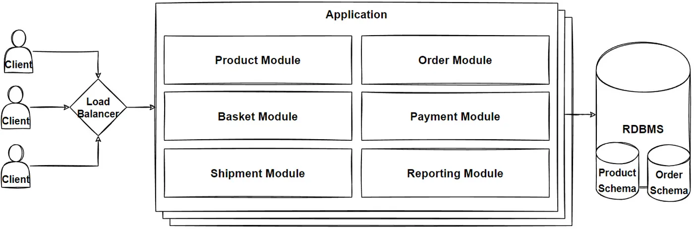
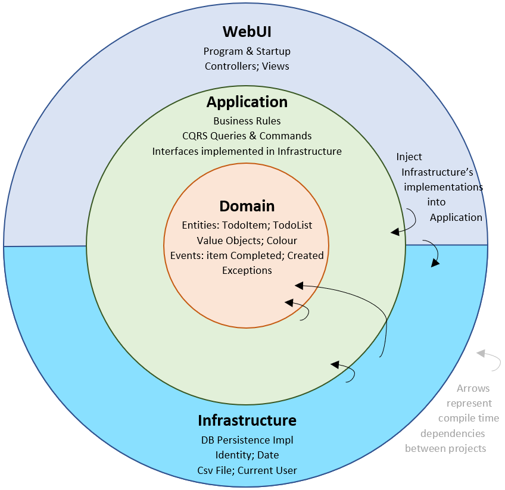
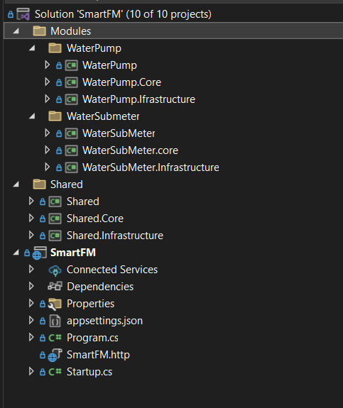
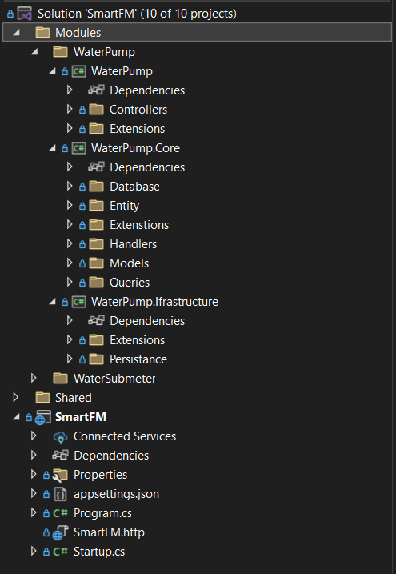
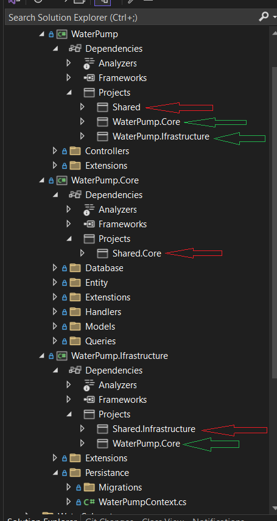
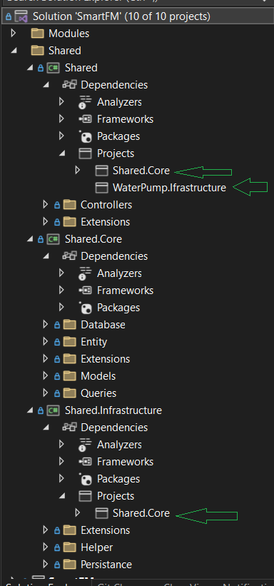
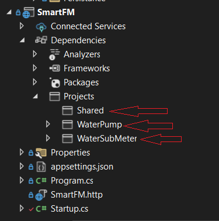
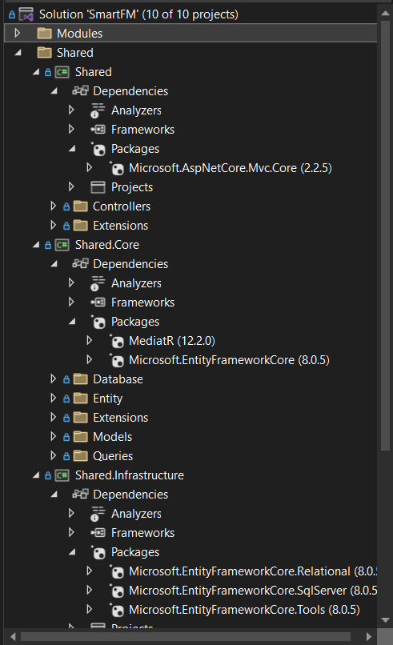
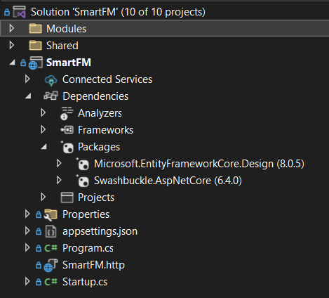

# **What is Modular Monolithic Architecture?**

Modular Monolithic Architecture is a software architecture that combines the **benefits of modular design** with the **simplicity** of a **monolithic** architecture. It involves dividing the system into a set of **loosely-coupled modules**, each with a well-defined boundary and explicit dependencies on other modules.



## **Benefits Of Modular Monolith:**

- The modular monolithic architecture **divided our application logic into modules**
- Each module will be **independent** and **isolated**
- Each module should have its own business logic — and, if necessary, its database or schema.
- Deploying a modular monolith is simpler compared to distributed systems, as there’s only one deployment artifact to manage
- A well-structured modular monolith offers a clear path to a micro services architecture. We can separate the module to an independent service when the need arises.

Read More:

[What Is a Modular Monolith? - GeeksforGeeks](https://www.geeksforgeeks.org/what-is-a-modular-monolith/)

[What Is a Modular Monolith? (milanjovanovic.tech)](https://www.milanjovanovic.tech/blog/what-is-a-modular-monolith)

#
# Mediator Pattern


## **Description**

The Mediator Pattern reduces complexity and dependencies between objects by introducing a mediator. This mediator handles communication between components, promoting loose coupling.

#### **Components**

- **Mediator Interface**: Defines communication methods.
- **Concrete Mediator**: Implements the mediator interface, managing interactions.
- **Colleagues**: Components that communicate via the mediator.

### **Benefits of the Mediator Pattern**

- **Reduces Coupling**: Objects don't directly reference each other.
- **Improves Readability**: Centralizes complex communication logic.
- **Enhances Flexibility**: Interaction changes don't affect components.
- **Simplifies Interactions**: Manages many-to-many relationships.
- **Promotes SRP**: Components focus on primary tasks, mediator handles communication.

### **Benefits of Using the Mediator Pattern in ASP.NET**

- **Centralized Logic**: Easier to manage and modify request handling.
- **Separation of Concerns**: Decouples sender and receiver.
- **Improved Maintainability**: Communication changes don't affect components.
- **Simplifies Testing**: Easier to mock interactions in unit tests.
- **Reduces Boilerplate**: Libraries like MediatR streamline request handling.
- **Enhanced Readability**: Centralized handling improves code organization.
- **Scalability**: Facilitates adding and modifying features.

To Read more about mediator patter: [Mediator (refactoring.guru)](https://refactoring.guru/design-patterns/mediator)


#
# Clean Architecture



### Onion Architecture is a software design pattern that promotes loose coupling, high cohesion, and separation of concerns. Let’s dive into the details:

## **Principles of Onion Architecture:**

- **Inversion of Control (IoC):** The architecture relies on IoC, where layers interface with each other toward the core (representing the domain). Unlike traditional multi-tier architectures, it doesn’t depend on the data layer but focuses on actual domain models.
- **Core Domain Layer:** At the center, we have the domain layer, housing business and behavior objects. This layer is independent of external dependencies.
- **Layer Flow:** The flow of dependencies moves from outer layers toward the core, reducing unnecessary coupling.

## **Layers of Onion Architecture:**

- **Domain Layer:** Contains domain objects (business logic) at the core. Interfaces define interactions with other layers.
- **Application Services Layer:** Coordinates domain objects, handles use cases, and interfaces with external systems.
- **Infrastructure Layer:** Deals with external concerns like databases, UI, and frameworks. It depends on the inner layers but not vice versa.

## **Benefits:**

- **Maintainability:** Clear separation makes it easier to modify and extend the codebase.
- **Testing:** Loose coupling enables effective unit testing.
- **Flexibility:** Reuse components across different applications.
- **Identifying Issues:** Clear boundaries help identify and fix issues efficiently.

Read More: [Clean Architecture in ASP.NET Core - NDepend Blog](https://blog.ndepend.com/clean-architecture-for-asp-net-core-solution/)

#

## Project Structure:



The Main project is a **WebApi (SmartFM) Project**.<br>
Other Projects are **Class Library Project**.

The projects are connected with references. We can think this project is a single project. But logically separated.<br> In future we can separate the projects by creating a new project and cut the module and add reference

#
## Module Structure:



### Here the modules structure follows clean architecture.

- Core is consisting of domain models and business logic.
- The main is containing Controllers and others
- The infrastructure is containing Database layer and etc

#

## Project References:
> **Water Pump project Reference**



> **Shared project reference:**



> **Api Project Reference:**



For example, pick **Water Pump Module**. The project contains all references of shared module. The **External Module** reference is shown in <span style="color:red;">Red Arrow</span> and the internal reference in <span style="color:green;">Green Arrow</span>

#
## Package of the project:
> **Shared Module Packages**



### As All other modules take reference of shared module. So, the packages are installed are in only **shared module**.
### **Shared**
The package in shared used for provide controller properties

  - **Microsoft.AspNetCore.Mvc.Core**:
    - **Purpose:** Provides essential MVC components and features for building web applications using the Model-View-Controller (MVC) pattern in ASP.NET Core.
    - **Key Features:** Includes controllers, action results, model binding, validation, routing, filters, dependency injection, middleware integration, and facilitates development of web APIs and web applications handling HTTP requests and responses efficiently.
  

### **Core**
In core the package mediatR use for resolve request from modules and transfer data. Efcore is use for relation query

  - **Entity Framework Core (EF Core):** Simplifies database access and management through object-relational mapping (ORM) in .NET applications.
  - **MediatR**: Facilitates decoupled communication between components using the mediator pattern in .NET applications.

### **Infrastructure**
In Infrastructure the packages are used for database migration and generating Database models.
  - **Entity Framework Core (EF Core)**: Provides the core ORM functionalities and APIs for .NET applications.
  - **Microsoft.EntityFrameworkCore.SqlServer**: A database provider for EF Core, specifically optimized for SQL Server interactions.
  - **Microsoft.EntityFrameworkCore.Tools**: Command-line tools for EF Core, aiding in database migrations, scaffolding, and other development tasks.

> **WebApi project packages:**



In web api project the Efcore design and swagger package
  - **Microsoft.EntityFrameworkCore.Design:** Facilitates EF Core database migrations and scaffolding DbContext and entity classes from existing schemas, integrating command-line tools (dotnet ef) for streamlined development workflows.
  - **Swashbuckle.AspNetCore:** Automatically generates Swagger/OpenAPI documentation for ASP.NET Core Web APIs, enabling interactive documentation and testing through Swagger UI.

#
# How the project integrated internally:

***<span style="color: red;">To Avoid confusion please track the location after namespace</span>***
> **Internal Controller Feature Provider**

<span style=" text-decoration: underline;">Shared>Infrastructure>Helper>InternalControllerFeatureProvider </span>

```c#
namespace Shared.Infrastructure.Helper
{
    internal class InternalControllerFeatureProvider : ControllerFeatureProvider
    {
        protected override bool IsController(TypeInfo typeInfo)
        {
            if (!typeInfo.IsClass)
            {
                return false;
            }
            if (typeInfo.IsAbstract)
            {
                return false;
            }
            if (typeInfo.ContainsGenericParameters)
            {
                return false;
            }
            if (typeInfo.IsDefined(typeof(NonControllerAttribute)))
            {
                return false;
            }
            return typeInfo.Name.EndsWith("Controller", StringComparison.OrdinalIgnoreCase) ||
                    typeInfo.IsDefined(typeof(ControllerAttribute));
        }
    }
}
```
This will detect the controllers from the different service

> **BaseController**

<span style=" text-decoration: underline;">Shared>Shared>Controllers> BaseController </span>

```C#
namespace Shared.Controllers
{
    [ApiController]
    public class BaseController(ISender sender) : ControllerBase
    {
        protected readonly ISender sender = sender;
    }
}
```

Which Contains definition of ApiController. And initialize ISender from MediatR. ISender will help to resolve query requests by scanning the Assembly reference. Later part will discuss the process.

> **Shared Infrastructure Extension**
> 
<span style=" text-decoration: underline;">Shared> InfraStructure>Extensions>ServiceCollectionExtension</span>

```C#
namespace Shared.Infrastructure.Extensions
{
    public static class ServiceCollectionExtensions
    {
        public static IServiceCollection AddSharedInfrastructure(this IServiceCollection services, IConfiguration config)
        {
            services.AddControllers()
                .ConfigureApplicationPartManager(manager =>
                {
                    manager.FeatureProviders.Add(new InternalControllerFeatureProvider());
                });
            services
                .AddDatabaseContext<SharedDbContext>(config)
                .AddScoped<ISharedDbContext>(provider => provider.GetService<SharedDbContext>());
            return services;
        }

        public static IServiceCollection AddDatabaseContext<T>(this IServiceCollection services, IConfiguration config) where T : DbContext
        {
            var connectionString = config.GetConnectionString("Default");
            services.AddMSSQL<T>(connectionString!);
            return services;
        }
        private static IServiceCollection AddMSSQL<T>(this IServiceCollection services, string connectionString) where T : DbContext
        {
            services.AddDbContext<T>(m => m.UseSqlServer(connectionString, e => e.MigrationsAssembly(typeof(T).Assembly.FullName)));
            using var scope = services.BuildServiceProvider().CreateScope();
            var dbContext = scope.ServiceProvider.GetRequiredService<T>();
            dbContext.Database.Migrate();
            return services;
        }
    }
}
```

Here added the InternalControllerFeatureProvider
and Extension method to add

- SqlServer
- AddMSSQL

If needed we can add more

> **Module Context**

<span style=" text-decoration: underline;"> Shared>InfraSturcture>Persistance > ModuleDbContext </span>

```C#
namespace Shared.Infrastructure.Persistance
{
    public abstract class ModuleDbContext : DbContext
    {
        protected abstract string Schema { get; }
        protected ModuleDbContext(DbContextOptions options) : base(options)
        {
        }
        protected override void OnModelCreating(ModelBuilder modelBuilder)
        {
            if (!string.IsNullOrWhiteSpace(Schema))
            {
                modelBuilder.HasDefaultSchema(Schema);
            }
            base.OnModelCreating(modelBuilder);
            modelBuilder.ApplyConfigurationsFromAssembly(GetType().Assembly);
        }
        public override async Task<int> SaveChangesAsync(CancellationToken cancellationToken = default)
        {
            return await base.SaveChangesAsync(true, cancellationToken);
        }
    }
}
```

The method will add the schema and dbContext from different services. We will inherit in Shared Context. Then all other context will inherit the share context
> **Shared Context**

<span style=" text-decoration: underline;"> Shared>Infrastructure>Persistance > SharedDbContext </span>

```C#
namespace Shared.Infrastructure.Persistance
{
    public class SharedDbContext : ModuleDbContext, ISharedDbContext
    {
        public SharedDbContext(DbContextOptions options) : base(options)
        {
        }

        public DbSet<Locations> Locations { get; set; }

        protected override string Schema => "core";
    }
}
```

Here Shared context inherited modules context. Which help to detect context and schema

The shared db context will contain all common db sets. So, after inherited all have the access to common db sets.

#

# **How A Module works Modular**

**Let's pick Water Pump Module**

> **Water Pump Infrastructure Extension**

Add db context

<span style=" text-decoration: underline;">Infrastructure>Extensions>ServiceCollectionExtension</span>

```C#
namespace WaterPump.Ifrastructure.Extensions
{
    public static class ServiceCollectionExtensions
    {
        public static IServiceCollection AddWaterPumpInfrastructure(this IServiceCollection services, IConfiguration config)
        {
            services
                .AddDatabaseContext<WaterPumpContext>(config)
                .AddScoped<IWaterPumpContext>(provider => provider.GetService<WaterPumpContext>());
            return services;
        }
    }
}
```

> **Water Pump Core Extension**

Add MediatR

```C#
namespace WaterPump.Core.Extenstions
{
    public static class ServiceCollectionExtensions
    {
        public static IServiceCollection AddWaterPumpCore(this IServiceCollection services)
        {
            services.AddMediatR(x => x.RegisterServicesFromAssemblies(Assembly.GetExecutingAssembly()));
            return services;
        }
    }
}
```

>**Water Pump Extension**

Add Core and Infrastructure

```C#
namespace WaterPump.Extensions
{
    public static class ServiceCollectionExtensions
    {
        public static IServiceCollection AddWaterPumpModule(this IServiceCollection services, IConfiguration configuration)
        {
            services
                .AddWaterPumpCore()
                .AddWaterPumpInfrastructure(configuration);
            return services;
        }
    }
}
```

>**Web Api Startup**

Add Water Pump Module and pass configuration

```C#
// This method gets called by the runtime. Use this method to add services to the container.
public void ConfigureServices(IServiceCollection services)
{
    services.AddSharedModule(Configuration);
    services.AddWaterSubmeterModule(Configuration);
    services.AddWaterPumpModule(Configuration);
    services.AddSwaggerGen(c =>
    {
        c.SwaggerDoc("v1", new OpenApiInfo
        {
            Title = "API",
            Version = "v1"
        });
    });
}
```
#
# **How An Api Call works in The Module**

> **Add Module Data Base**

Inherit the shared db context which resolves the db connection and provide shared context dbset like Location. Here this Schema is “WaterPump”. And shared context Schema was “Core. Same database but logically separated

```C#
namespace WaterPump.Infrastructure.Persistance
{
    internal class WaterPumpContext : SharedDbContext, IWaterPumpContext
    {
        public WaterPumpContext(DbContextOptions options) : base(options)
        {
        }
        protected override string Schema => "waterPump";

        public DbSet<WaterPumpInfo> WaterPumpInfos { get; set; }


    }
}
```

> **Create A request**

Inherit **IRequest** From MediatR
```c#
namespace WaterPump.Core.Queries
{
    public record WaterPumpCreateRequest(WaterPumpCreate model):IRequest<int>;

}
```


> **Handle The Request**

Inherit the **IRequestHandler** From MediatR. And handle the request

```C#

namespace WaterPump.Core.Handlers
{
    internal class WaterPumpCreateHandler(IWaterPumpContext context) : IRequestHandler<WaterPumpCreateRequest, int>
    {
        public async Task<int> Handle(WaterPumpCreateRequest request, CancellationToken cancellationToken)
        {
            var pump = new WaterPumpInfo
            {
                LocationId = request.model.LocationId,
                PumpType = request.model.PumpType,
                WaterPumpNo = request.model.WaterPumpNo
            };
            await context.WaterPumpInfos.AddAsync(pump);
            await context.SaveChangesAsync(cancellationToken);

            return pump.Id;
        }
    }
}
```


>**Call From Controller**

Inherit **Base Controller**. And Inject ISender From MediatR.
Create query pass the parameter.
And send the query.
MediatR will handle the request.

```C#
namespace WaterPump.Controllers
{
    [Route("/api/WaterPump/[controller]")]
    internal class WaterPumpController(ISender sender) : BaseController(sender)
    {
        [HttpGet]
        public async Task<IActionResult> Get()
        {
            var query = new GetPums();
            return Ok(await sender.Send(query));
        }

        [HttpPost]
        public async Task<IActionResult> Create(WaterPumpCreate pumpCreate)
        {
            var query = new WaterPumpCreateRequest(pumpCreate);
            return Ok(await sender.Send(query));
        }
    }
}
```

#

# **How Call Other Module Query**

Let's say, we want to access some data from water pump module.

>**Create the query in shared Query**

As all modules has the reference of Shared. So Other Module can access this request.

```C#
namespace Shared.Core.Queries
{
    public record class GetPums : IRequest<List<WaterPumps>>;

}
```


> **Call the query From Shared Controller**

We are calling the query from shared controller. We also called the same query from Water Pump Controller.

```C#
namespace Shared.Controllers
{
    [Route("/api/Shared/[controller]")]
    internal class SharedController(ISender sender) : BaseController(sender)
    {
        [HttpGet]
        public async Task<IActionResult> Get()
        {
            var query = new GetPums();
            return Ok(await sender.Send(query));
        }

    }
}
```


> **Get Pump Handler**

The Get Pump handler in **Water Pump** module.
But we can access this by MediatR

```C#
namespace WaterPump.Core.Handlers
{
    internal class WaterPumpHandlers(IWaterPumpContext context) : IRequestHandler<GetPums, List<WaterPumps>>
    {
        public async Task<List<WaterPumps>> Handle(GetPums request, CancellationToken cancellationToken)
        {
            return await context.WaterPumpInfos.Select(x => new WaterPumps
            {
                Id = x.Id,
                WaterPumpNo = x.WaterPumpNo,
                LocationId = x.LocationId,
                PumpType = x.PumpType,
            }).ToListAsync();
        }
    }
}
```
#
## MediatR Interfaces

- **IMediator**: The full interface for sending requests and publishing notifications.
- **ISender**: A simplified interface for sending requests that expect responses.
- **IPublisher**: A simplified interface for publishing notifications to multiple handlers.

To Know more about the library: [Home · jbogard/MediatR Wiki (github.com)](https://github.com/jbogard/MediatR/wiki)
